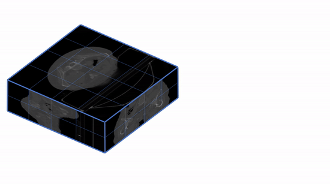
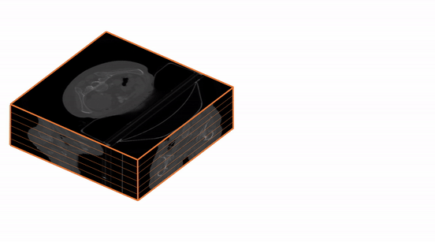
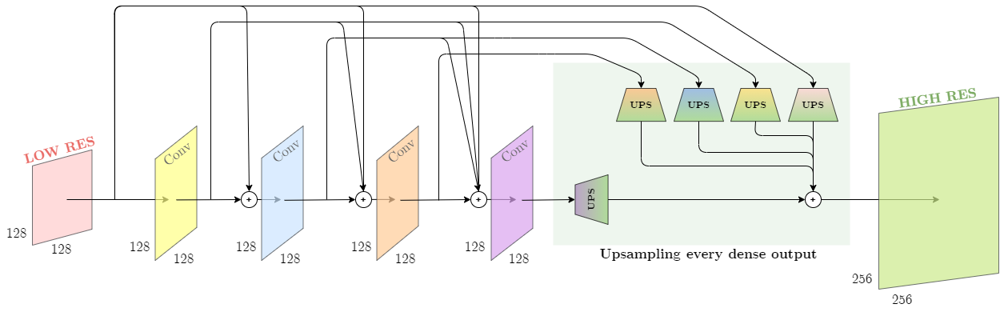
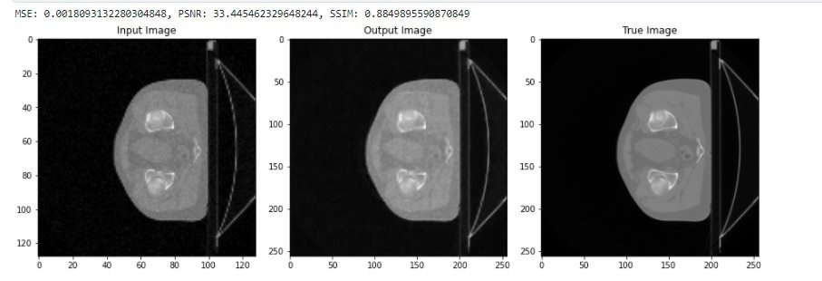
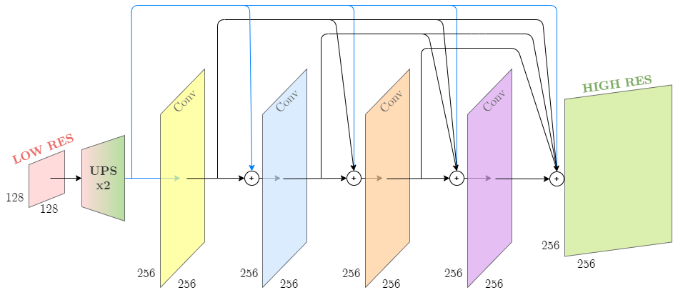
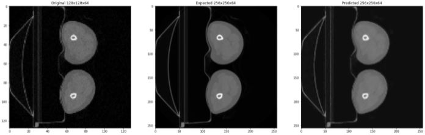

# Super-resolution 

In order to obtain super-resoultion images from low resolution CT images several models were used and compared. The aim of the project was to increase spacial resoultion and remove noise simultaneously. The dataset contains 58 3D noisy images with dimensions 128x128x64 and their labels which are 3D images without noise and dimensions 256x256x64.

Since it was very time consuming taking whole images as inputs and 3D Convolutional layers, some changes needed to be made. The aproaches that were tried:

* Decreasing number of batches
* Using 3D patches and 3D convolutional layers
* Using stack of slices and 2D convolutional layers

The best result was obtained by using the last mentoned aproach, in terms fof PSNR and SSIM values.

<table><tr>
<td>  </td>
<td>  </td>
</tr></table>

## DenseNet

Using typical DenseNet for this problem was not enough by itself, since the spacial resolution should be increased too. The image should be at some point upsampled and different architectures were used for that:

1. After each convolutional block the output was upsampled to have the label's dimensions and stored. The final point was to concatenate stored upsampled outputs and put it as an input for the last convolutional layer that will return the image with wanted dimensions.

2. Do the upsample in the very beginning and continue with wanted image dimensions by using the clasical DenseNet which does not change image dimensions.

It was experimented with the number of blocks where five of them gave the best resuts. 

### **3D Patches and 3D Convolutional Layers**

This architecture conains 5 convolutional blocks that have the following layers:

 LayerNormalization + ELU + Conv3D + UpSampling3D

 
<table><tr>
<td>  </td>
</tr></table>

The patches dimensions that were used as the input were 16x16x16 and their labels 32x32x16 and the number of batches was 4. The set was splited with ration 9:1. The advantage with paches is enlarging the training set, but the disadvantage were the artefacts that convolution can make on the border of patches. To overcome this problem, two techniques were used. One of them is overlapping the patches and the other one was experimenting with type of Normalization layers where the LayerNormalization gave the best results compared to BatchNormalization and SpectralNormalization. Removing the patches that contained the majority of black voxels was considered too, but instead of improving the results it made them way worse. While training the Mean Squared Error was used as a loss function. Each convolutional layer had a kernel size 3x3x3 and the number of filters was 48 for each convolutional layer except the first one where it was twice bigger. 

The final result for this method gave PSNR 33.87 and SSIM 0.89 on the test set. Specifically, the result on the first image in the test set was:

 
<table><tr>
<td>  </td>
</tr></table>

### **3D Patches and 2D Convolutional Layers**

In this architecture there are 4 convolutional blocks each containing the following layers:

 BatchNormalization + RELU + Conv2D

 
<table><tr>
<td>  </td>
</tr></table>

In the end, there is a 3D convolutional layer to obtain the wanted output dimensions. For this architecture ReLU gave better results than ELU as well as BatchNormalization compared to LayerNormalization. The number of batches was 1, the kernel size was constanlty 3x3x3, but the number of filters was decreasing for further layers. The initial number of filters was 8 and with each layer that number was multiplied with the scaling factor 0.25. The result on the test set was around 38 and 0.9 in terms of PSNR and SSIM respectively.

 
<table><tr>
<td>  </td>
</tr></table>

## Other Models

In this whole process the U-Net models was used too but did not gave good results. There were some modifications of DenseNet models too. The common thing is that the learning rate was 1e-4 for all of them as well as the Adam optimizational algorithm and the loss fuction which was MSE.

